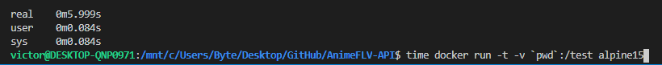
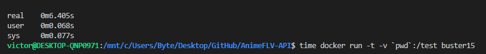
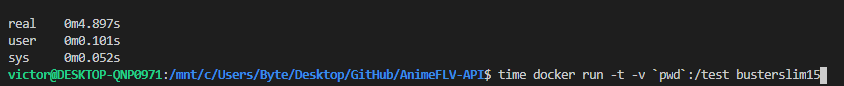
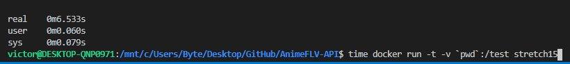
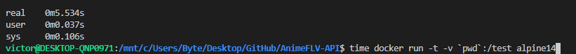
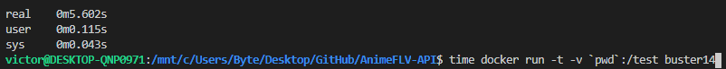
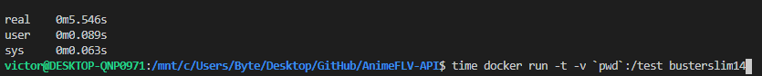
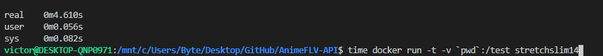
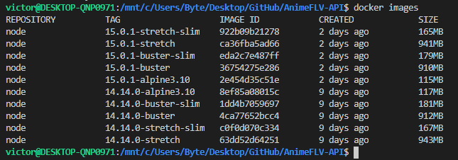
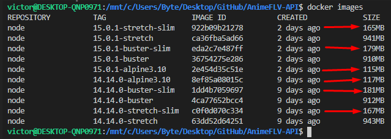

## Analisis de imagenes de Docker

Para la elección de la imagen de Docker, vamos a basarnos en dos parámetros, su tamaño (queremos un tamaño ligero) y la eficiencia al ejecutar los tests (el tiempo que tarda).

## Tiempos

- #### 15.0.1-alpine3.10
    
- #### 15.0.1-buster
    
- #### 15.0.1-buster-slim
    
- #### 15.0.1-stretch
    
- #### 14.14.0-alpine3.10
    
- #### 14.14.0-buster
    
- #### 14.14.0-buster-slim
    
- #### 14.14.0-stretch
    
- #### 14.14.0-stretch-slim
    

## Tamaños

-
    

    En cuanto a tamaños podemos descartar todas las versiones de buster o stretch que no sean "slim" ya que pesan demasiado para lo que queremos hacer.

    Las imagenes seleccionadas serían las siguiente:
    
    

## Conclusión

Las diferencias por tiempo al ejecutar los tests son pequeñas entre versiones ~1 seg.

Solo dos versiones han tardado menos de 5 segundos:

   - 15.0.1-buster-slim **4.89s**
   - 14.14.0-stretch-slim **4.61s**

Que además son dos de las imagenes menos pesadas:

   - 15.0.1-buster-slim **4.89s** **(179MB)**
   - 14.14.0-stretch-slim **4.61s** **(167MB)**

Por ende, la mejor versión es la **14.14.0-stretch-slim** ya que es la que más eficiente de todas y tiene un peso reducido.