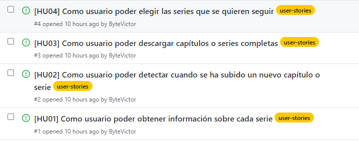
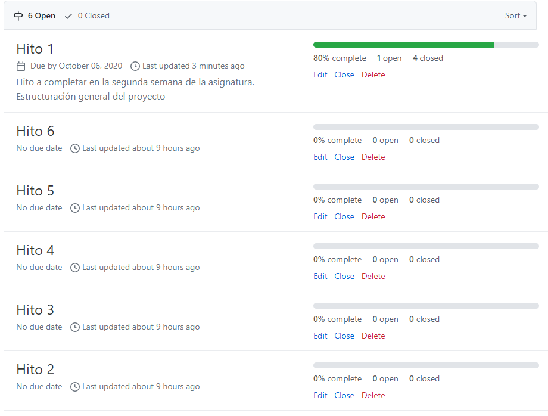

## [Historias de usuario 📚](https://github.com/ByteVictor/AnimeFLV-API/issues)
Aquí se irán añadiendo las historias de usuario que vayan surgiendo durante el desarrollo.

 - ### Primeras historias de usuario
	 - Inicialmente en el hito 1 hemos creado 4 historias de usuario las cuales se irán extendiendo y matizando en el futuro, probablemente también se incluyan nuevas historias de usuario.
     Todas están etiquetadas con el label que hemos creado "user-stories".
	 
## [Milestones 🏛](https://github.com/ByteVictor/AnimeFLV-API/milestones)
Se han creado 6 Milestones, una por cada hito, a los que se le irán asignando los issues correspondientes a cada hito.
