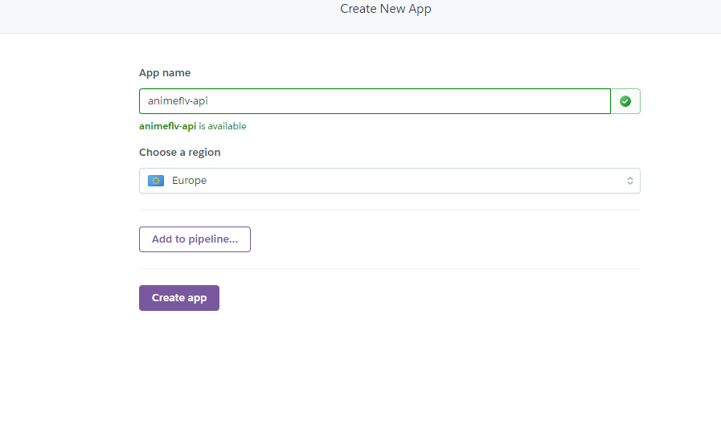
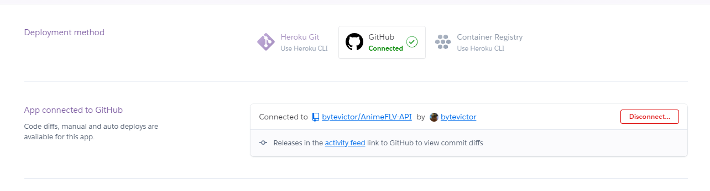
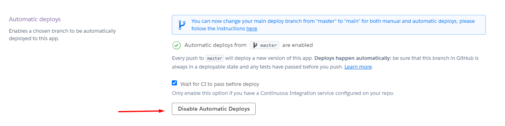

## Despligue en la nube, PaaS

**Justificación**

Se ha elegido Heroku como sistema para desplegar la aplicación en PaaS.

Esta decisión se ha basado en las siguientes razones, en un primer lugar se han buscado servicios PaaS compatibles con node o preferiblemente dedicado, muchos de ellos se han descartado automáticamente al ser de pago.
Tras ver varias documentaciones de distintos servicios, la decisión quedó entre Heroku y Openshift, ya que ambos tenían documentación disponible para el lenguaje en el que está desarrollado el microservicio (node.js). Al investigar más en profundidad la documentación, características y opiniones de ambos servicios, Heroku quedó como la mejor opción por varias características.

En primer lugar cuenta con una documentación muy clara y sencilla, además de una muy buena integración con GitHub, Openshift también la tiene pero la de Heroku es mas sencilla y automatizada, además de esto Heroku cuenta con documentación oficial centrada en el uso de no solo node, si no grunt, ambos de los sistemas que se emplean en este proyecto para desarrollar y desplegar el microservicio, por tanto era mejor opción en casi todas ramas respecto a Openshift para nuestro caso.

El despliegue en Heroku ha sido muy sencillo, al igual que en otros servicios similares se ha creado una cuenta y se ha enlazado con la cuenta de github, ya que, como hemos comentado, heroku cuenta con integración con la plataforma.

**Despliegue automático**

De nuevo, Heroku tiene una muy buena integración con github y toda la configuración para el despligue automático viene preconfigurada y no es necesario ni configurar un webhook a mano, consiste en darle al siguiente botón en la sección de configuración. 

De este modo, el sistema detecta cada vez que se realiza un push en el repositorio, reconstruye y despliega de nuevo el microservicio, además se ha optado por activar la opción que nos aporta Heroku para que espere a que los sistemas de integración continua pasen correctamente los tests antes de hacer un nuevo despligue para asegurarnos de que siempre habrá un despligue funcionando.

**Link al microservicio desplegado**

https://animeflv-api.herokuapp.com/status

Ninguna de las rutas de la api devuelve un status 500

Las distintas rutas de la api se pueden comprobar en la [Documentacion de la API de la anterior entrega](https://github.com/bytevictor/AnimeFLV-API/tree/master/docs/microservicio#microservicio-con-expressjs) 