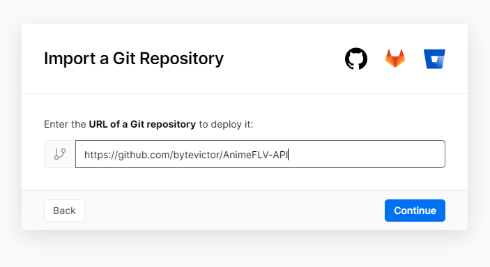
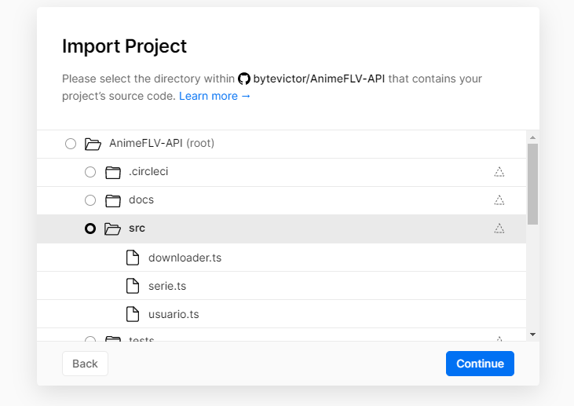
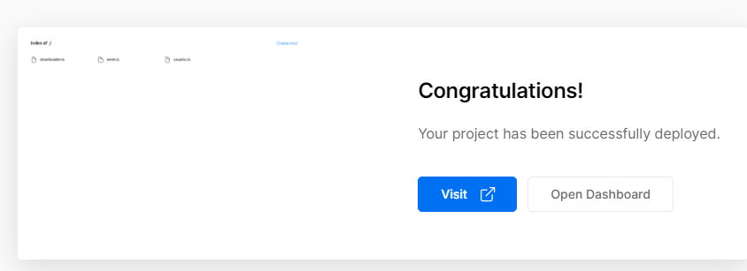
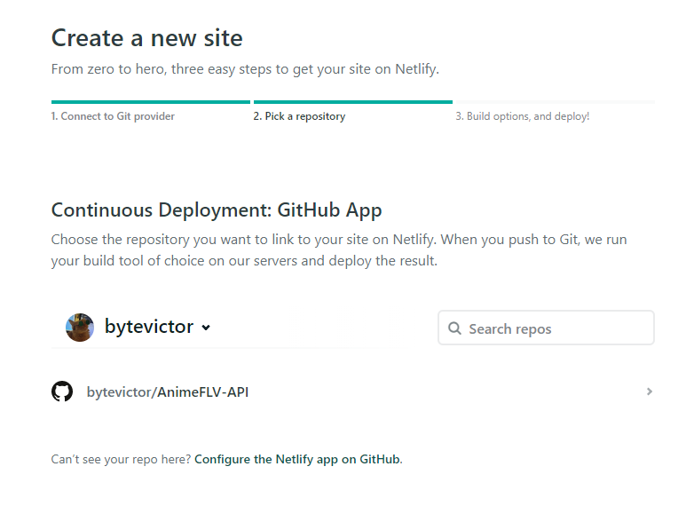
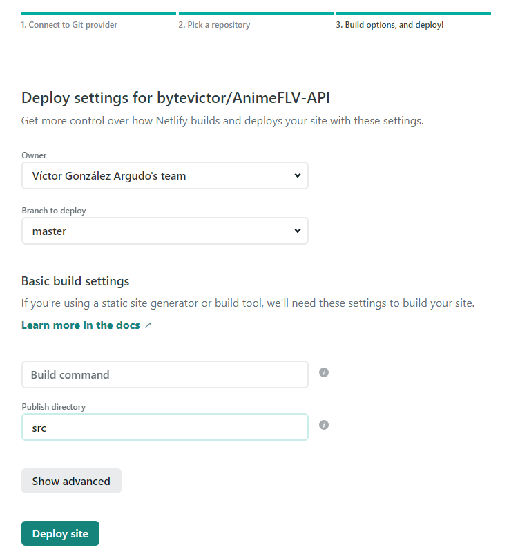

## Sistemas serverless

Se ha hecho uso de dos sistemas serverless para llevar a cabo el despliegue de algunas funciones del proyecto.

La conexión de ambos sistemas con el repositorio se puede consultar [en la siguiente documentación](https://github.com/bytevictor/AnimeFLV-API/blob/master/docs/sistemas_serverless/README.md)

- #### Vercel

    Después de conectar el sistema con nuestro repositorio hemos partido del siguiente [Código de ejemplo](https://vercel.com/docs/serverless-functions/supported-languages#using-typescript)
    Para comprobar que funciona, el test inicial está funcionando [AQUÍ](https://anime-flv-api.bytevictor.vercel.app/api/hola)

    Tras comprobar el funcionamiento de Vercel hemos desplegado una función que sirve para consultar si el sistema tiene una serie, si la tiene nos devuelve toda la información relativa a la misma, sinopsis, carátula, link y todos los links a los capitulos de la serie.

    [El código puede verse AQUÍ](https://github.com/bytevictor/AnimeFLV-API/blob/master/src/api/consultor.ts)

    [La función puede probarse AQUÍ](https://anime-flv-api.vercel.app/api/consultor?serie=Boku%20no%20Hero%20Academia)

- #### Netlify 

    Al igual que con Vercel, tras conectar el sistema con nuestro repositorio hemos partido de la documentación de Netlify para desplegar una función.

    En este caso nos encontramos con el problema de que netlify no admite Typescript, pero afortunadamente podemos traducir Typescript a Javascript empleando un transcriptor.
    > tsc 
    
    Hemos hecho una prueba de despliegue con este método:

    - [Despligue Netlify Holamundo](https://animeflv-api.netlify.app/.netlify/functions/holatype?msg=Saludo%20al%20mundo)
    - [Código Typescript](https://github.com/bytevictor/AnimeFLV-API/blob/master/functions/holatype.ts)
    - [Transcripción a Javascript](https://github.com/bytevictor/AnimeFLV-API/blob/master/functions/holatype.js)

    Tras ver que funciona correctamente, desplegamos una nueva función con este mismo método, diferente a la que hemos desplegado en Vercel, en este caso la intención es que nos devuelva una lista de las series que tiene el sistema.

    - [Despligue Netlify BuscaSeries](https://animeflv-api.netlify.app/.netlify/functions/buscaseries)
    - [Código Typescript](https://github.com/bytevictor/AnimeFLV-API/blob/master/functions/buscaseries.ts)
    - [Transcripción a Javascript](https://github.com/bytevictor/AnimeFLV-API/blob/master/functions/buscaseries.js)

## Conexión de GitHub con Vercel

Importamos nuestro repo desde Vercel

Nos pedirá los permisos, los aceptamos y seleccionamos la carpeta donde está el código del proyecto (ya que el resto no deberíamos de necesitarlo)

Y con esto ya tendríamos el repo contectado a Vercel y podemos acceder a /src desde el link que nos genera vercel

## Conexión de GitHub con Netlify

Es un procedimiento muy similar a Versel, nos logeamos con GitHub y elegimos el repositorio

Volvemos a especificar el directorio src como punto de montaje.

Y con esto ya tenemos conectado netlify a nuestro repositorio.

