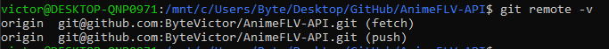

## Configuración Inicial de Github

 - ### Creación y Configuración de Claves
	 

	> En mi caso ya contaba con un par de claves RSA privada y pública así que simplemente he tenido que hacer un cat de la clave pública y copiarla en las settings de github.
	
    </img>

 
 - ### Configuración cuenta git con github

   > En mi caso también estaba configurado ya la cuenta de github en git así que solo he tenido que añadir el VSCode como editor.
   	
   	</img>

   	</img>